# Coverage report

#### Failing Regression:
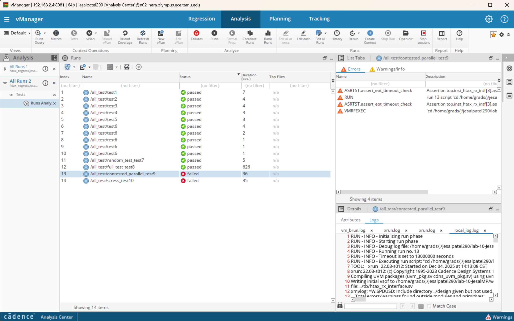

#### Passing Regression after the failing regression:
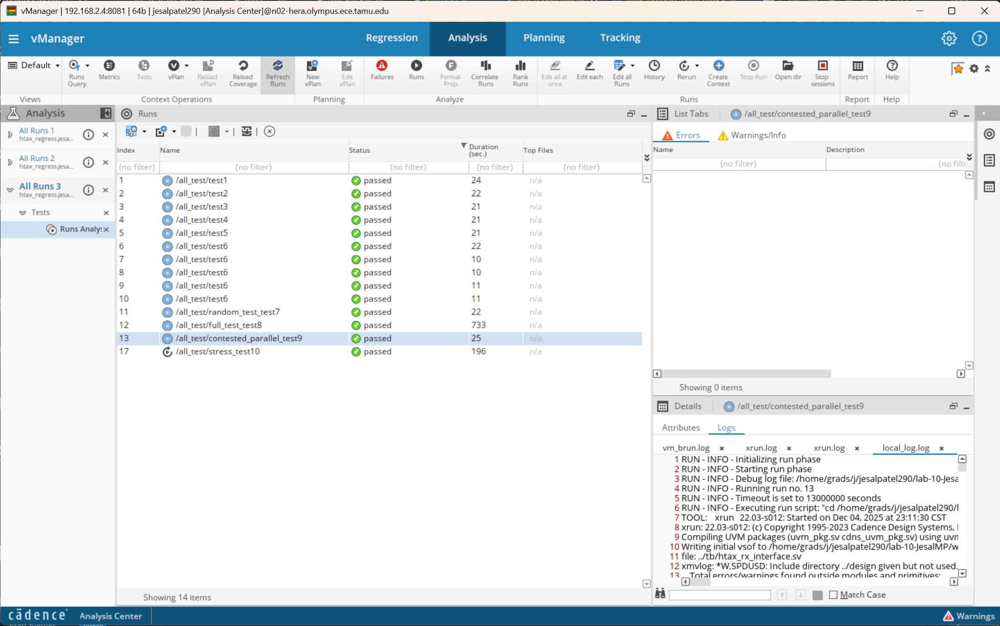
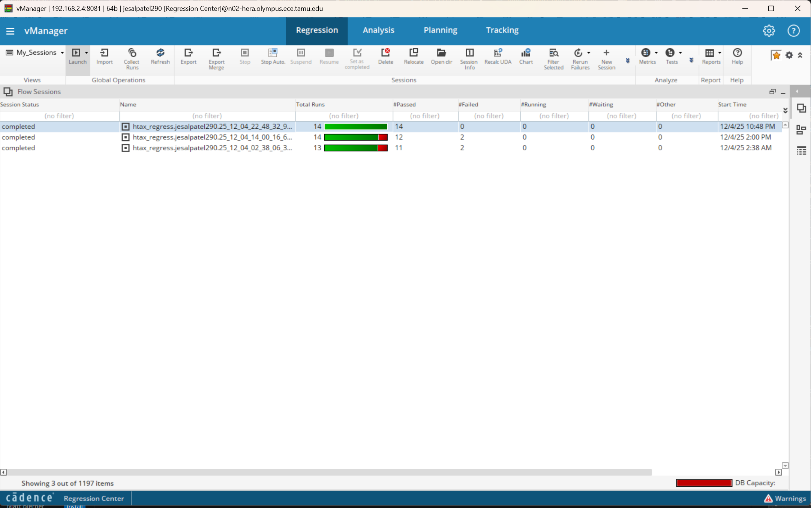

#### TestCases Mapped:
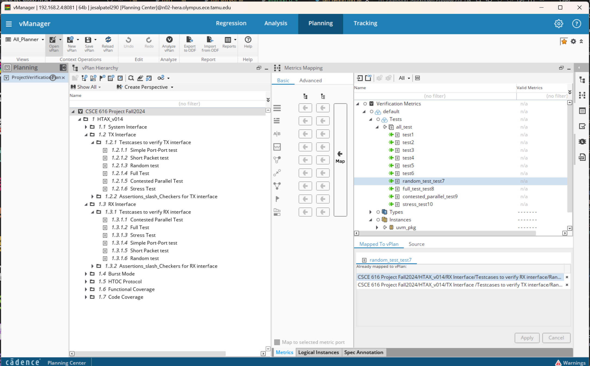
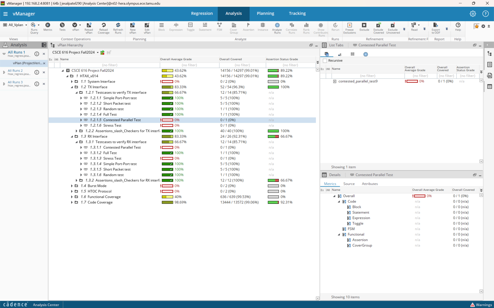

#### Assertions/Checkers for Tx interface:

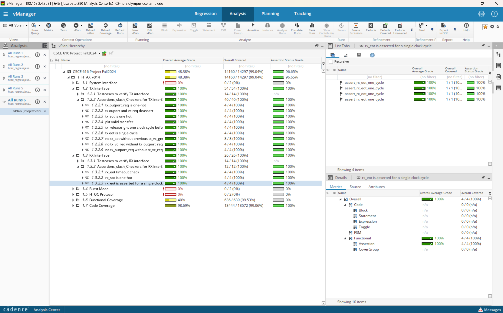
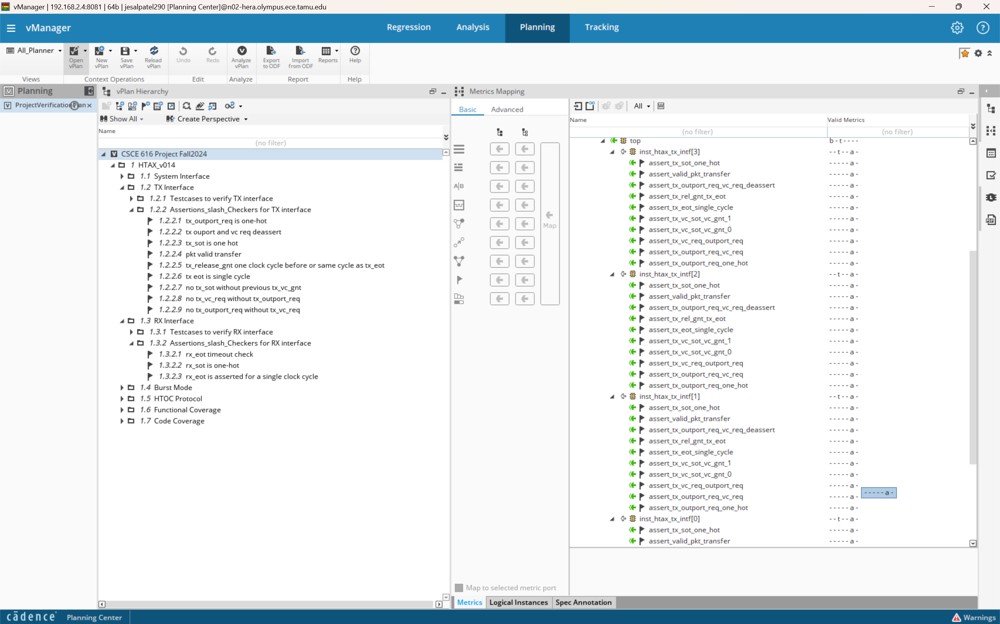

#### Assertions/Checkers for Rx interface:
Buggy: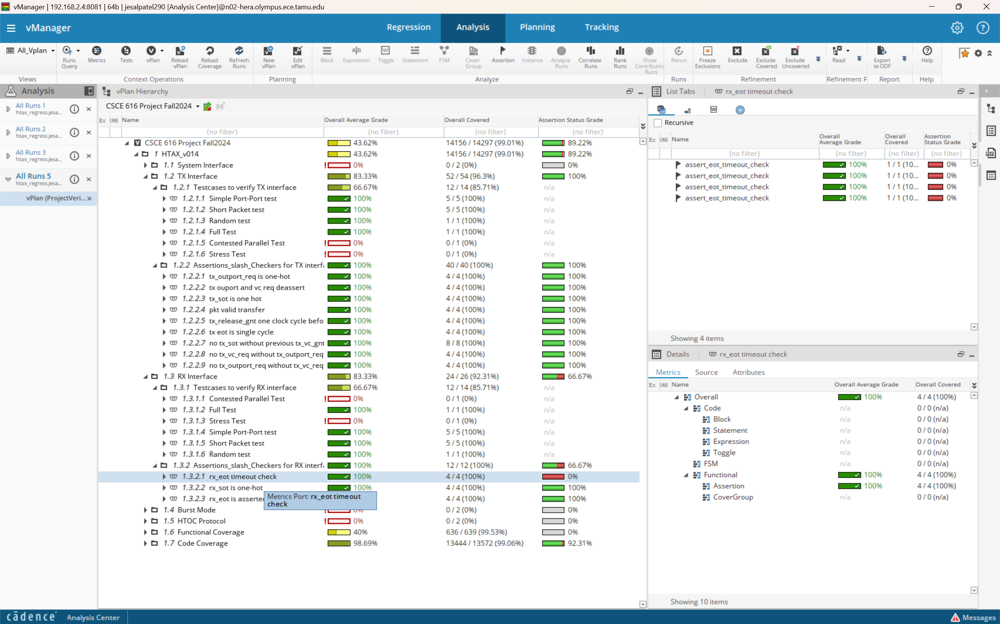
BugFixed: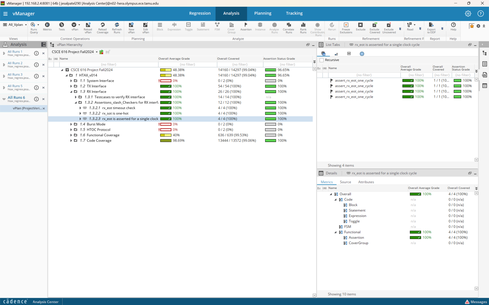
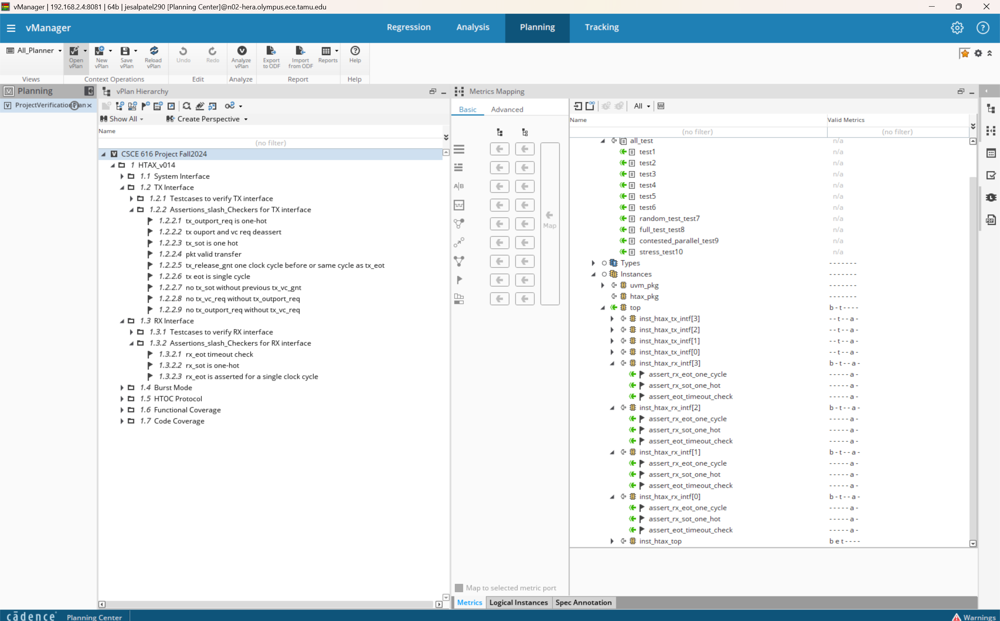

#### Functional Coverage for Tx interface:
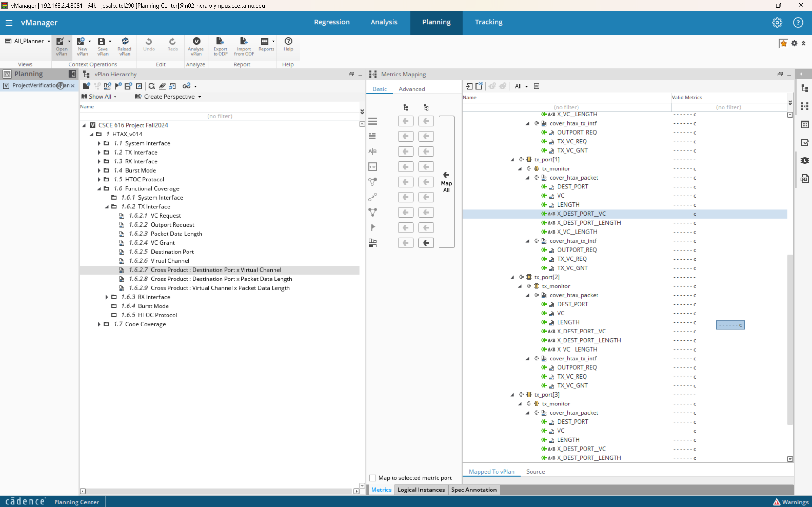

#### Functional Coverage for Rx interface:
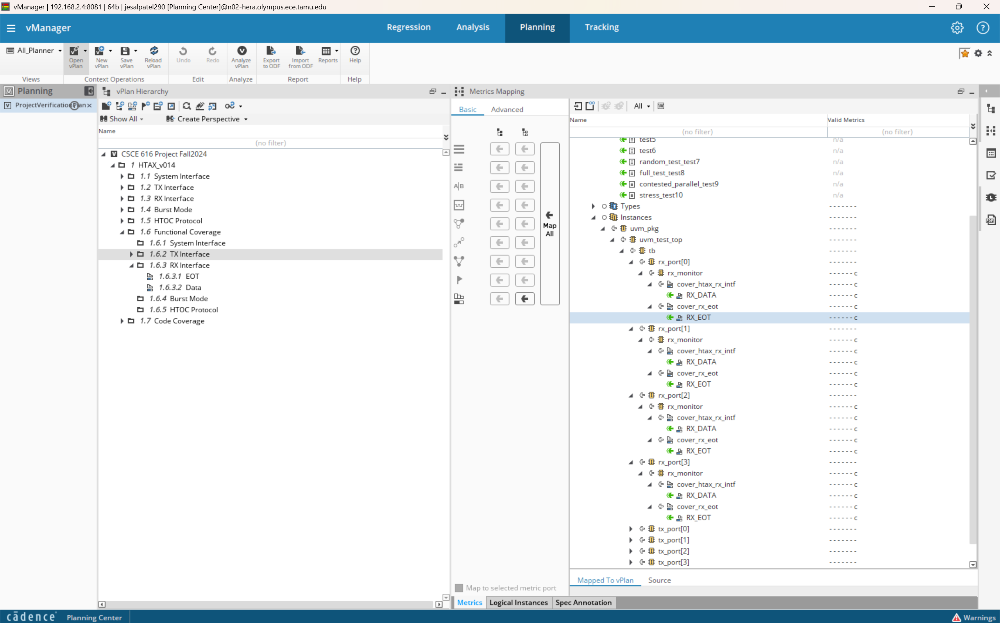

#### Code Coverage:
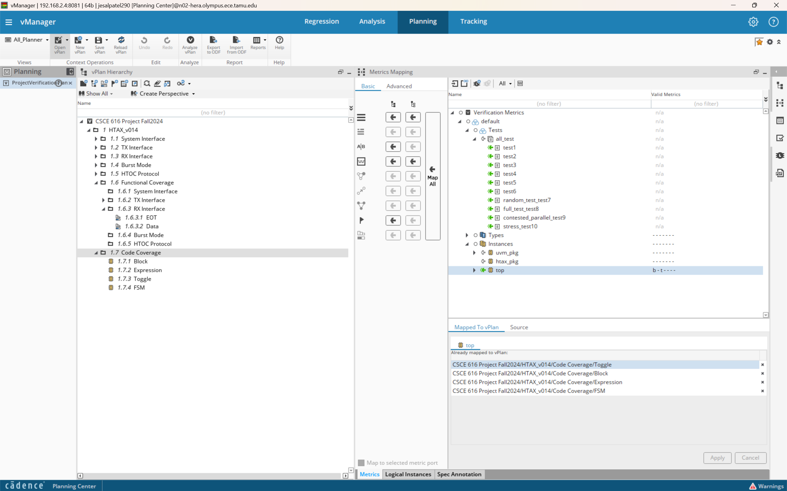

#### Code Coverage Holes:
A 98.69% Code coverage can't be classified as having coverage hole, however these can be due to conditional code blocks that are never reached throughout test stimulus. However, as per google, a 97+ code coverage is generally considered excellent.

# Bugs report

### Bug 1

#### What is the bug?
The bug presents itself in cases and combinations of pkt.length and pkt.delay such that across all RX serving FUs' outport assert EOT signal in same clock cycle, which means in this case, eot isn't ever asserted leaving the RX hanging.

#### Where is it?
Module: Outport Mux

File: htax_outport_data_mux.v

Line number(s): 43

#### How to reproduce:
The bug is caught by the assertion which checks if rx_eot is asserted within the 1000cycle threshold of rx_sot being asserted. To achieve this, we can start firing packets in parallel on all RX ports such that their end of transfer is asserted in the same cycle.

#### Expected behavior:
Regardless of anything, eot should be asserted withing last data transfer cycles to RX.

#### Actual behavior:
EOT in RX isn't asserted if EOT is to be asserted on all RX FUs in same cycle.

#### Bug fix:
Looking at the logic written in line 43, htax_outport_data_mux.v which selects the eot wire, the condition "~(&(eot_in)" which is kept in AND with "|(eot_in & inport_sel_reg)" is causing the bug. Simple fix is to remove it, i.e. assign selected_eot = |(eot_in & inport_sel_reg);.

#### Failing Assertion:
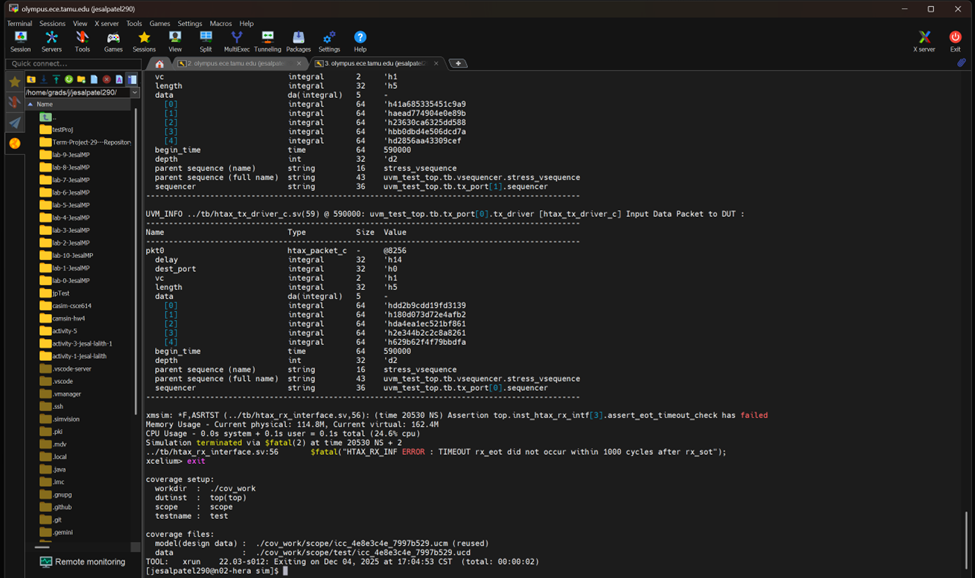

#### Failing Scenario Waveform:
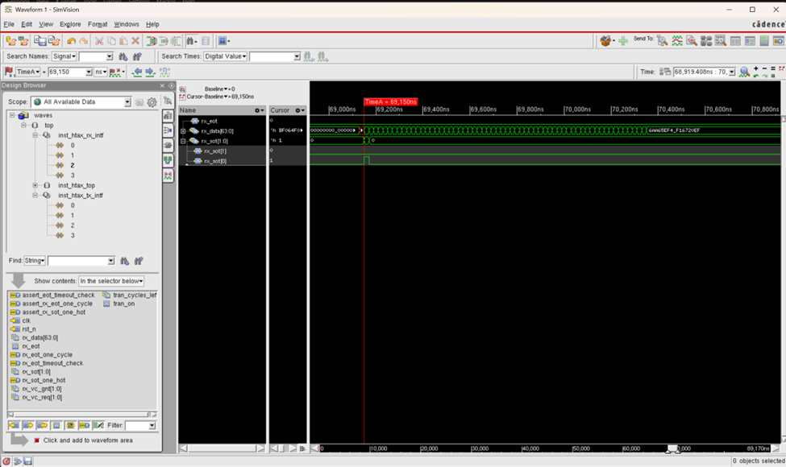
#### Failing Assertion Passing after the fix:

